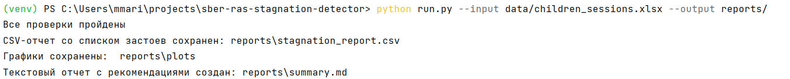
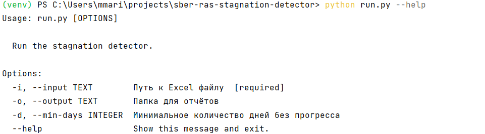
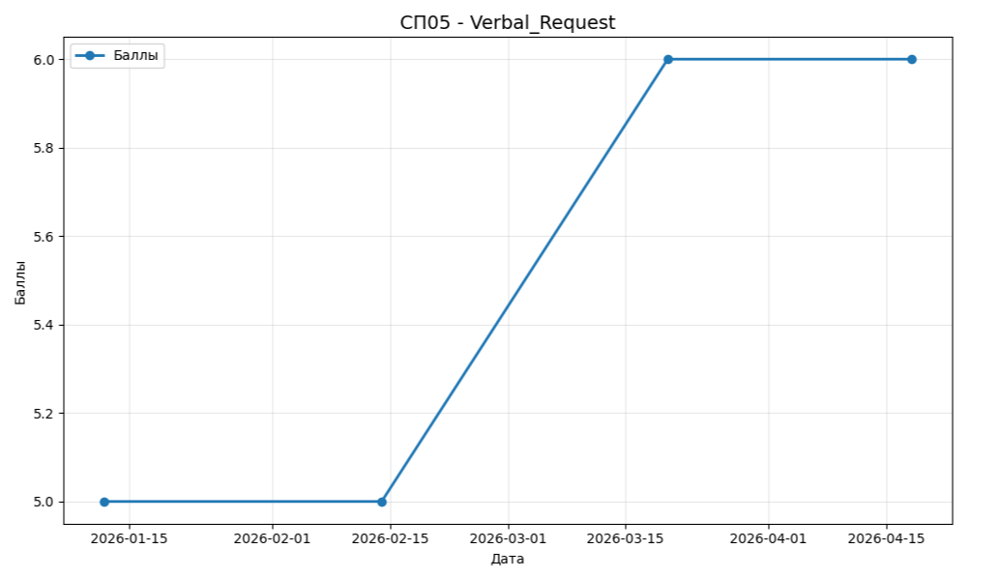
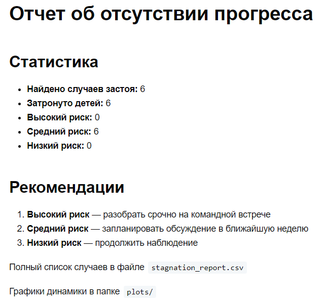

# sber-ras-stagnation-detector

**Тестовое задание для Data Science** в проекте Сбера:  
*AI-агент для автоматизации диагностики и составления индивидуальных программ развития детей с РАС/ОВЗ*

Проект анализирует диагностические данные детей с РАС, выявляет случаи, когда по отдельным навыкам нет улучшений в течение 28 дней и более, и формирует отчеты для педагогов.

---

## 1. Запуск проекта

### Локальный запуск (через Python)

```bash
# Склонируйте репозиторий
git clone https://github.com/Marina-Mokina/sber-ras-stagnation-detector.git
cd sber-ras-stagnation-detector

# Создайте виртуальное окружение
python -m venv venv
source venv/bin/activate      # для Linux/Mac
# или
venv\Scripts\activate          # для Windows

# Установите зависимости
pip install -r requirements.txt

# Запустите анализ
python run.py --input data/children_sessions.xlsx --output reports/
```

### Запуск через Docker

```bash
# Соберите образ
docker build -t sber-stagnation .

# Запустите контейнер
docker run --rm \
  -v ${PWD}/data:/app/data \
  -v ${PWD}/reports:/app/reports \
  sber-stagnation \
  python run.py --input /app/data/children_sessions.xlsx --output /app/reports/
```

**Примечание:** папки `data` и `reports` должны существовать в корне проекта. В `data` положите файл `children_sessions.xlsx` с колонками:  
`child_id`, `domain`, `session_date`, `assessment_score`.

---

## 2. Выбранные технологии
 
- **Python 3.11** – основной язык для Data Science
- **pandas** – обработка и анализ данных
- **pytest** – тестирование логики модулей (валидации и детекции застоя)
- **matplotlib** – построение графиков динамики прогресса детей
- **click** – создание интерфейса командной строки
- **Docker** – воспроизводимость окружения, изоляция, легкий запуск на любой платформе

Выбор технологий соответствует требованиям ТЗ:  
- запуск одной командой,  
- контейнеризация,  
- unit-тесты,  
- наглядные отчеты (CSV, графики, текстовый summary).

---

## 3. Архитектура решения

```
sber-ras-stagnation-detector/
├── data/                  # входные файлы (не попадают в git)
├── reports/               # результаты (создаются при запуске)
│   ├── stagnation_report.csv
│   ├── summary.md
│   └── plots/             # графики для каждого случая застоя
├── src/
│   ├── config.py          # константы (пути, имена колонок, пороги)
│   ├── validation.py      # проверка входных данных
│   ├── stagnation.py      # основная логика выявления застоя
│   └── reporting.py       # генерация графиков, CSV и текстового отчета
├── tests/                 # unit-тесты
├── Dockerfile
├── requirements.txt
├── run.py                 # точка входа (CLI)
└── README.md
```

**Пайплайн обработки:**

1. **Загрузка** – `pandas.read_excel()`
2. **Валидация** – проверка наличия колонок, отсутствия NaN, формата child_id (СП01…), диапазона баллов (0–100)
3. **Детекция застоя** – для каждого ребенка и навыка берутся два последних замера. Если между ними прошло ≥28 дней и балл не вырос (дельта ≤ 0; дельта — это разница между последним и предыдущим баллом; отрицательная дельта означает снижение, ноль — отсутствие прогресса), то фиксируется застой. Вычисляется уровень риска:
   - `high` – дельта < -5 или интервал > 60 дней
   - `medium` – дельта == 0
   - `low` – дельта < 0, но выше -5
4. **Формирование отчетов**:
   - CSV-таблица всех случаев застоя
   - Графики динамики баллов для каждого ребенка по навыку. Сохраняются в `reports/plots/`
   - Текстовый summary со статистикой и рекомендациями для педагогов. 

**Логика функции `detect_stagnation`:**

Функция получает таблицу с данными о детях (замеры по разным навыкам в разные даты). Для каждого ребенка и каждого навыка она:

1. Находит последний и предпоследний замер.
2. Считает, сколько дней прошло между ними.
3. Считает, как изменился балл (разницу между последним и предпоследним).
4. Если прошло 28 дней или больше и балл не вырос (разница ≤ 0), то этот случай записывается в отчет как "отсутствие прогресса".
5. Дополнительно вычисляется уровень риска (высокий, средний, низкий) в зависимости от того, насколько упал балл или как долго длится отсутствие прогресса.

---

## 4. Компромиссы и допущения

- **Сравниваем только два последних замера**  
  Анализируется не вся история ребенка, а только последний и предпоследний замер по каждому навыку. Однако для задачи "не было прогресса за последние 4 недели" этого достаточно.

- **Строки с пропусками не анализируются**  
  Если в обязательных колонках есть пустые значения, они отбрасываются. Методы заполнения пропусков могли бы внести ложные данные.

- **Уровень риска считается упрощенно**  
  Уровень риска определяется по правилам: на сколько упал балл и как долго нет прогресса. Более точная модель потребовала бы размеченных примеров от экспертов, которых нет в проекте.

- **Нет базы данных**  
  Все результаты сохраняются в файлы: CSV, PNG, Markdown. Данная структура соответствует тестовому заданию.

Все компромиссы не противоречат ТЗ.

---

## 5. Проверка работы сервиса

### Запуск unit-тестов

```bash
pytest tests/ -v
```

Все тесты должны быть зелеными (PASSED).

### Проверка результатов на реальных данных

После запуска пайплайна:

1. Откройте `reports/stagnation_report.csv` – там будут строки с детьми, у которых застой.
2. Посмотрите `reports/plots/` – графики динамики по каждому найденному случаю.
3. Прочитайте `reports/summary.md` – статистика и рекомендации.

Пример отчета (фрагмент CSV):

| child_id | domain | last_session_date | last_score | previous_score | delta | days_diff | risk_level |
|----------|--------|-------------------|------------|----------------|-------|-----------|------------|
| СП05     | Verbal_Request | 2026-04-18        | 6          | 6              | 0     | 29        | medium     |

---

## 6. Примеры вызовов CLI и скриншоты

### Запуск с параметрами по умолчанию

```bash
python run.py --input data/children_sessions.xlsx
```
Отчеты сохранятся в `reports/`

### Запуск с указанием папки и другого порога застоя

```bash
python run.py -i data/children_sessions.xlsx -o my_reports -d 30
```

### Справка

```bash
python run.py --help
```

**Пример запуска программы с параметрами:**  


**Справка по команде:**  


**Пример графика:**  


**Пример текстового отчета (summary.md):**  

```
